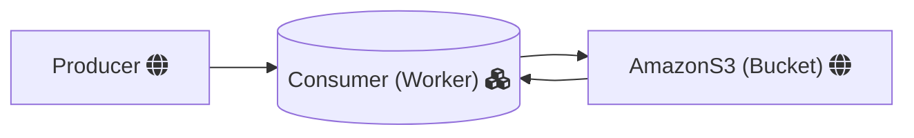

## Handle Images 

This worker takes a message from a rabbitmq queue and process an image on a AmazonS3 bucket based on the message info.

The message must fit the HandleImageDTO:
{
    "width": 
    "height": 
    "region":
    "bucketname"
    "fileName"
    "outputKey"
}

Width and Height => Describe the image size
Region => The AmazonS3 Bucket region
BucketName => The AmazonS3 Bucket name
fileName => The name of the file on the bucket
outputKey => The outputKey from the file

## Tests

For now you can test the resize service by running the ImageResizeTest on the test directory