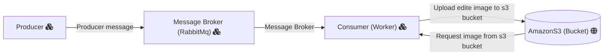

## Handle Images 

This worker takes a message from a rabbitmq queue and process an image on a AmazonS3 bucket based on the message info.

The message must fit the HandleImageDTO:
```
{
    "width": 
    "height": 
    "region":
    "bucketname"
    "fileName"
    "outputKey"
}
```

- Width and Height:  Describe the image size <br>
- Regions: The AmazonS3 Bucket region <br>
- BucketNames: The AmazonS3 Bucket name <br>
- fileNames: The name of the file on the bucket <br>
- outputKeys: The outputKey from the file <br>


# Application Properties

Before running the application, change the varibles on application.properties to fit you development local

server.port => Port that the http server gonna be running

spring.rabbitmq.host=> rabbitmq broker host
spring.rabbitmq.port=> rabbitmq broker port
spring.rabbitmq.username=> rabbitmq broker valid username
spring.rabbitmq.password=> rabbitmq broker valid password
spring.rabbitmq.queue=> rabbitmq broker queue that the application gonna consume

aws.accessKeyId=> your access key to amazon s3
aws.secretKey=> your amazon secretKey to amazon s3


## Tests


For now you can test the resize service by running the ImageResizeTest on the test directory